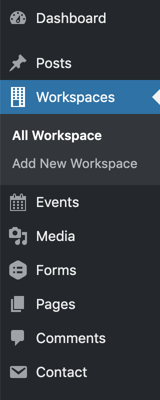
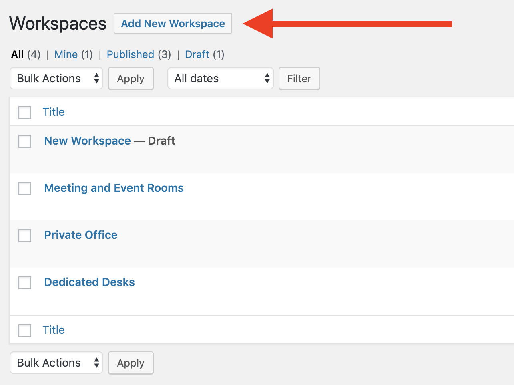
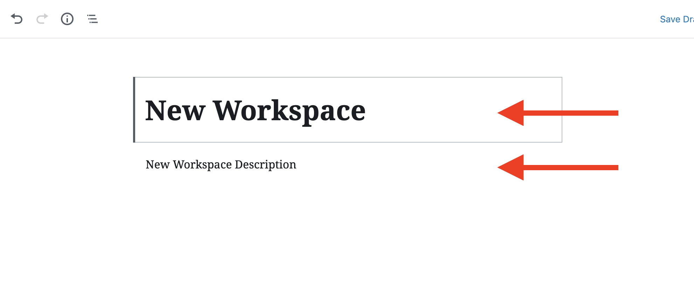
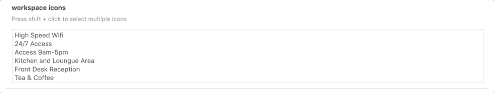
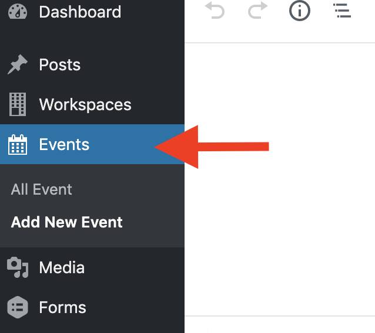
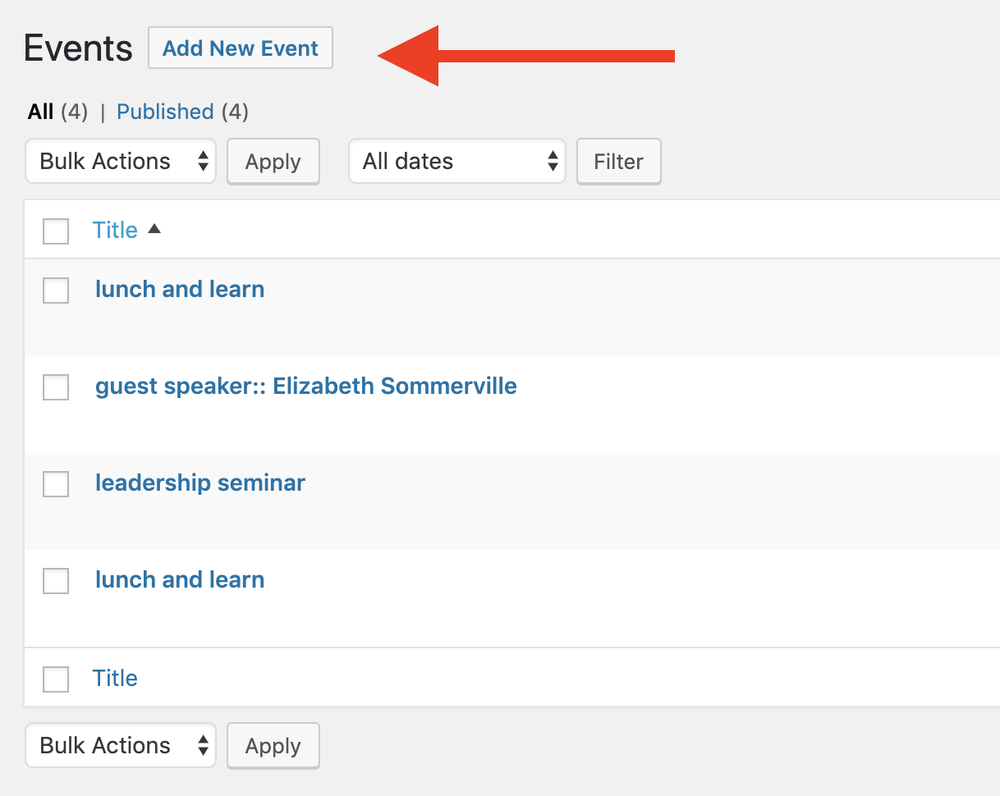
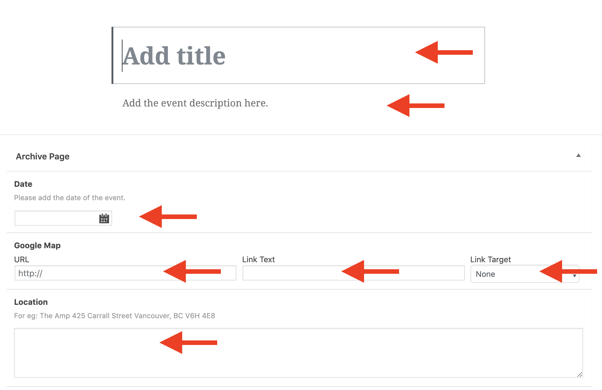
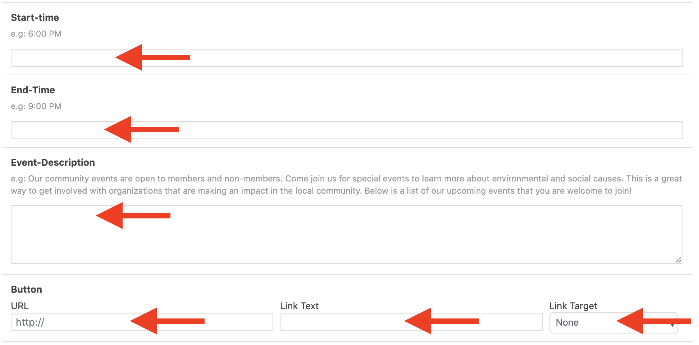
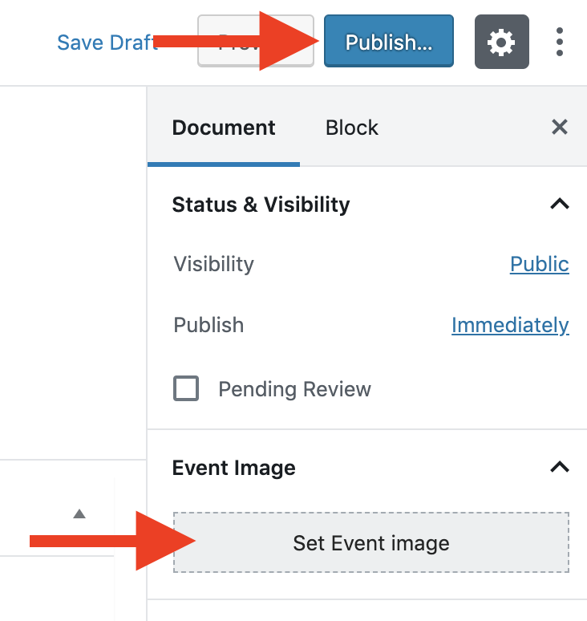

# AMP

A WordPress starter theme AMP Vancouver, forked from Underscores.

## Installation

### 1. Download me (don't clone me!)

Then add me to your `wp-content` directory.

### 2. Rename the `red_amp-master` directory

Make sure that the theme directory name is project appropriate!

### 3. Install the dev dependencies

Next you'll need to run `npm install` **inside your theme directory** next to install the node modules you'll need for Gulp, etc.

### 3a. Plugin Dependencies

#### Contact Form 7 
Used to create the contact us page.

#### Custom Field Suite
Used for create custom fields for workspaces, events, testimonials and the meet the team members.

#### Gravity Forms
Used to create the main book a tour form for the website.

### 4. Update the proxy in `gulpfile.js`

Lastly, be sure to update your `gulpfile.js` with the appropriate URL for the Browsersync proxy (so change `localhost[:port-here]/[your-dir-name-here]` to the appropriate localhost URL).

 
## Theme description
 
### The theme includes the following template files:

The theme supports carousel images using the flickity plugin and a default menu:

Flickity: The carousels on the website were done with the Flickity jquery plugin.

Styling for the flickity required use of !importants because the generic styling was very specfic.

Menus:
The default menu is in header.php, and uses the Menus admin
 
### Styling
There is one general Media Query for mobile layout at 760px. All screens under that threshold will display as mobile.

The max width for all screens is 1400px.
 

### There are 2 custom post types:
- Workspaces
- Events

### Workspaces

Custom fields for workspaces

Steps for creating a new workspace
#### Step 1

#### Step 2

#### Step 3

#### Step 4

#### Step 5

#### Step 6

### Events

Custom fields for workspaces.

Steps for creating a new event.

#### Step 1

#### Step 2

#### Step 3

#### Step 4

#### Step 5

### Forms

